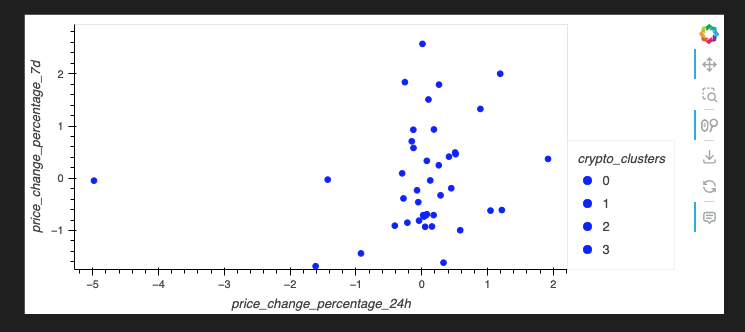
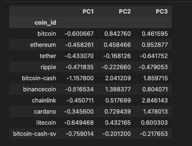
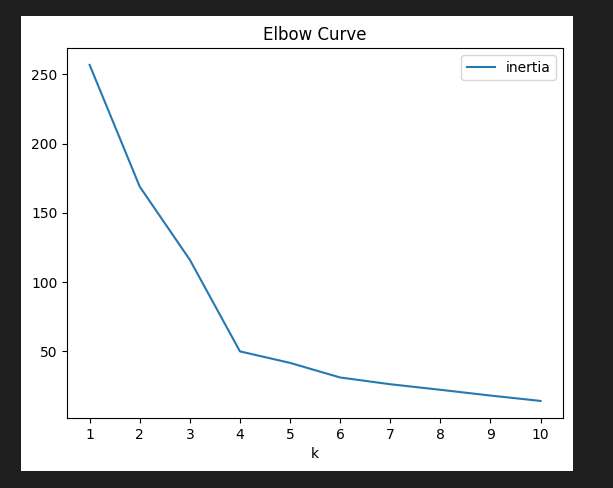
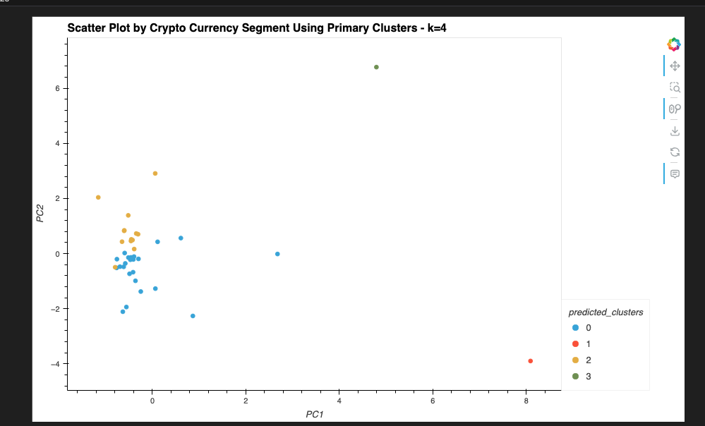

# CryptoClustering
Clustering Cryptocurrencies - Columbia AI Bootcamp 

##Module 11 Challenge

In this project I apply the unsupervised learning technique of K-Means clustering to group cryptocurrencies by their performance in an effort to create profitable portfolio recommendations.

##Data Used
crypto_market_data.csv - market data of different cryptocurrencies during different time periods

##Summary
I start by using the elbow curve method, using normalized data, to find the optimal k value for the K-Means model that will use all of the original features of the dataset.

Elbow curve line plot showing a value of 4 for k to be optimal for the dataset with all features

Then, using the optimal k value I train and predict the K-Means model to generate 4 clusters of cryptocurrencies. The inertia of each cluster was significant enough to consider reducing the amount of features.

To reduce the amount of features used, I applied Principal Component Analysis to create 3 primary clusters.

DataFrame holding 3 primary clusters as columns and cryptocurrency as index

Used the PCA data to again calculate the optimal k value for the K-Means model.

Next, with the optimal k value for the PCA features, I plot the new clusters.

Technologies
This is a Python 3.7 project ran using a Visual Studios in a conda dev environment.

Visual Studios 
Pandas
Matplotlib
Numpy
hvPlot
scikit-learn